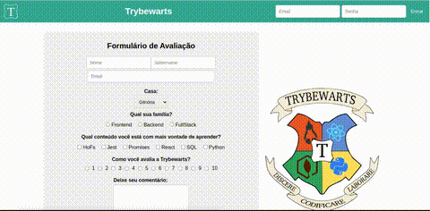

<body>
  <h1 align="center">Project Todo-list</h1>
  

    
  

  <h2 align="center">Descrição</h2>
  
Primeiro <b>projeto em grupo</b> do curso, colocamos em prática habilidades de criação de formulários, responsividade e posicionamento de objetos na tela, desenvolvendo uma página de formulário para a escola de magia de Trybewarts, em que as pessoas usuárias poderiam enviar feedbacks sobr a escola.

  <h2 align="center">Habilidades Desenvolvidas</h2>
  
No desenvolvimento deste projeto foi implementado um formulário em <b>HTML</b> para estruturação do conteúdo da página, o <b>CSS</b> e o <i>Flexbox</i> foram utilizados para organizar e estilizar a página. O comportamento dinâmico da página foi adicionado com o <b>JavaScript</b>.

  <h2 align="center">📁 Acesso ao projeto</h2>
  

    <dl>
        <dt>Para acessar o projeto faça o clone do repositório.</dt>
        <dd>No terminal utilize o comando: <code>git@github.com:JorgeCase/jorge-case-trybewarts-project.git</code></dd>
        <dd>Entre na pasta do repositório que você acabou de clonar: <code>cd jorge-case-trybewarts-project</code></dd>
    </dl>
  

  <h4 align="center">Este projeto é um dos requisitos para a formação de Desenvolvimento Web da Trybe</h4>
  
O projeto finaliza a <b>Seção 5 - HTML e CSS: Forms, Flexbox e Responsivo</b> do Módulo de Fundamentos e foi um projeto desenvolvido em grupo com <b>dezenove</b> requisitos obrigatórios e <b>quatro</b> requisitos optativos. Neste projeto obtivemos <b>100% de aprovação</b>.

    
Lista de requisitos obrigatórios:

  <ul>
    <li>Crie uma barra verde na parte superior da página.</li>
    <li>Adicione o logotipo da Trybewarts com a classe <code>trybewarts-header-logo</code> na barra superior.</li>
    <li>Acrescente um formulário de login no canto direito da barra superior contendo os inputs de email, senha e um botão de login.</li>
    <li>Crie um título com o texto <code>Trybewarts</code> centralizado dentro do <code>Header</code>.</li>
    <li>Adicione um formulário no corpo da página.</li>
    <li>Faça com que o eixo principal do formulário seja vertical.</li>
    <li>Adicione a logo da Trybewarts no lado direito da página.</li>
    <li>Acrescente ao formulário com id <code>evaluation-form</code> os inputs de <code>nome</code>, <code>sobrenome</code> e <code>email</code>.</li>
    <li>Acrescente ao formulário um select com o id <code>house</code> contendo as opções <code>Gitnória</code>, <code>Reactpuff</code>, <code>Corvinode</code> e <code>Pytherina</code>.</li>
    <li>Posicione os campos de <code>Nome</code> e <code>Sobrenome</code> para que fiquem em linha.</li>
    <li>Acrescente ao formulário um campo de entrada para qual família a pessoa estudante se identifica.</li>
    <li>Crie campos de entrada do tipo <code>checkbox</code> contendo seis opções</li>
    <li>Crie campo de entrada para avaliar de 1 a 10 o nível de satisfação com a Trybewarts</li>
    <li>Crie uma textarea com o id <code>textarea</code> e uma label com a classe <code>textarea</code> contendo o número máximo de caracteres igual à 500</li>
    <li>Crie um campo de entrada do tipo <code>checkbox</code> com o id <code>agreement</code> para validar as informações</li>
    <li>Crie um botão de Enviar para submeter o formulário</li>
    <li>Faça com que o botão <code>Enviar</code> seja habilitado somente após a checkbox do requisito 16 ser selecionada</li>
    <li>Crie um rodapé no final da página</li> 
  </ul>
  
Lista de requisitos optativos:

  <ul>
    <li>Crie um contador com o ID <code>counter</code> contendo o número de caracteres disponíveis no textarea, variando de 500 até 0, que deverá ser atualizado a medida que algo for digitado na textarea.</li>
    <li>Faça com que ao clicar no botão <code>Enviar</code>, o conteúdo do formulário seja substituído pelas informações preenchidas.</li>
    <li>Preencha o arquivo feedback.md . Aproveite o espaço para deixar seus feedbacks sobre o projeto.</li>
    <li>Realize o desenvolvimento da versão mobile do formulário Trybewarts.</li>
  </ul>

  

    Participaram deste projeto além de mim, os colegas <b>Danilo Leão de Oliveira</b> e <b>Leandro Miranda</b>
  

  

    <h4 align="center">Para mais informações sobre a formação de Desenvolvimento Web da Trybe, clique no link abaixo.</h4>
    <a href='https://www.betrybe.com/'>Curso de Desenvolvimento Web Trybe</a>
  

</body>
